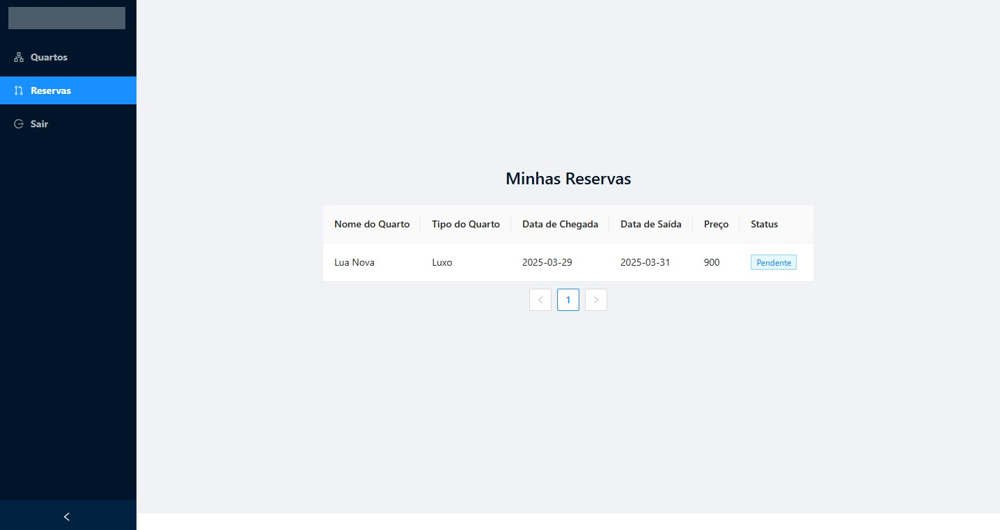

<p align="center">
  <a href="https://portfolio-3-d-olive.vercel.app/"></a>
</p>
<div align='center'>
  <h3> 
    Bem Vindo ao Projeto 
    
  </h3>
    
</div>

<br>

<p align="center">
  <a href="https://api.whatsapp.com/send?phone=+5584991604054">
  
  </a>
</p>


<p align="center">
  <a href="https://portfolio-3-d-olive.vercel.app/">
    
  </a>
</p>


<br><br>


## Visão Geral
Este é um sistema de gerenciamento de hospedagem desenvolvido com **Spring Boot** no backend e **Angular 19** no frontend. O sistema permite a gestão de reservas, quartos e usuários, oferecendo funcionalidades diferenciadas para administradores e clientes.
<br>

<br>
## Tecnologias Utilizadas
- **Backend**: Java com Spring Boot
- **Frontend**: Angular 19
- **Banco de Dados**: PostgreSQL
- **Autenticação**: JWT (JSON Web Token)

## Estrutura do Projeto

### Backend (Spring Boot)
Localização: `PousadaServer`

Principais arquivos e diretórios:
- `configs/`
  - `JwtAuthenticationFilter.java`: Filtro de autenticação JWT
  - `SimpleCorsFilter.java`: Configuração de CORS
  - `WebSecurityConfiguration.java`: Configuração de segurança
- `controller/admin/`
  - `ReservationController.java`: Gerenciamento de reservas (admin)
  - `RoomsController.java`: Gerenciamento de quartos
- `controller/auth/`
  - `AuthController.java`: Autenticação e cadastro de usuários
- `controller/customer/`
  - `BookingController.java`: Reserva de quartos (usuário)
  - `RoomController.java`: Consulta de quartos
- `dto/`
  - DTOs para comunicação entre frontend e backend
- `entity/`
  - `Reservation.java`: Entidade de reserva
  - `Room.java`: Entidade de quarto
  - `User.java`: Entidade de usuário
- `enun/`
  - `ReservationStatus.java`: Status das reservas
  - `UserRole.java`: Perfis de usuários

### Frontend (Angular 19)
Localização: `PousadaWeb`

Principais módulos e componentes:
- `src/app/modules/auth/`
  - Tela de login e cadastro de usuários
- `src/app/modules/admin/`
  - Painel administrativo para gerenciar quartos e reservas
- `src/app/modules/customer/`
  - Interface para clientes realizarem reservas
- `src/app/services/`
  - Serviços para comunicação com o backend

## Manual de Uso

### Tela de Login
Ao iniciar o sistema, o usuário acessa a tela de login. Aqui, é possível:
- Fazer login como administrador ou usuário comum
- Criar uma conta caso ainda não tenha


### Menu do Administrador
Após o login como **administrador**, as seguintes opções estão disponíveis:

#### Cadastrar Quartos
O administrador pode cadastrar novos quartos informando nome, tipo e valor da diária.


#### Gerenciar Quartos
Permite editar e excluir quartos cadastrados.


#### Gerenciar Reservas
Visualização e gerenciamento de reservas:
- **Aguardando confirmação**
- **Aprovadas**
- **Rejeitadas**


### Menu do Usuário
Após o login como **usuário comum**, as seguintes opções estão disponíveis:

#### Fazer Reserva
O usuário pode escolher um quarto disponível e realizar uma reserva.


#### Minhas Reservas
Permite visualizar todas as reservas feitas, com detalhes:
- Nome do quarto
- Tipo de quarto
- Data de entrada e saída
- Valor total
- Status da reserva




## Instalação e Execução

### Backend (Spring Boot)
1. Clone o repositório:
   ```sh
   git clone https://github.com/AlexandreLiberatto/GerenciamentoHospedagem.git
   ```
2. Acesse o diretório do backend:
   ```sh
   cd PousadaServer
   ```
3. Configure o banco de dados no `application.properties`.
4. Execute o projeto:
   ```sh
   mvn spring-boot:run
   ```


### Frontend (Angular 19)
1. Acesse o diretório do frontend:
   ```sh
   cd PousadaWeb
   ```
2. Instale as dependências:
   ```sh
   npm install
   ```
3. Execute o projeto:
   ```sh
   ng serve
   ```
4. Acesse o sistema no navegador: `http://localhost:4200`


## Contribuição
Se desejar contribuir com melhorias, siga estes passos:
1. Fork o repositório
2. Crie uma branch para sua funcionalidade (`git checkout -b minha-feature`)
3. Commit suas alterações (`git commit -m 'Minha nova feature'`)
4. Envie para o repositório remoto (`git push origin minha-feature`)
5. Abra um Pull Request

   
<br><br>

<br><br>

##  Contatos

[](https://api.whatsapp.com/send?phone=+5548991604054)
[](https://www.linkedin.com/in/alexandre-liberato-32179624b/)
[](mailto:alexandreliberatto@gmail.com)


<br><br>

<br><br>

<div align='center'>
  Pegue as ondas, sinta ás vibrações positivas!
</div>


